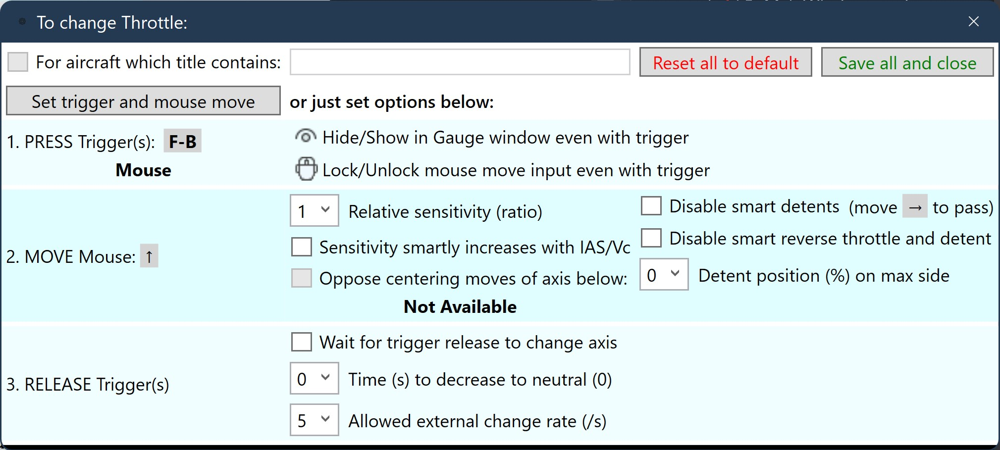
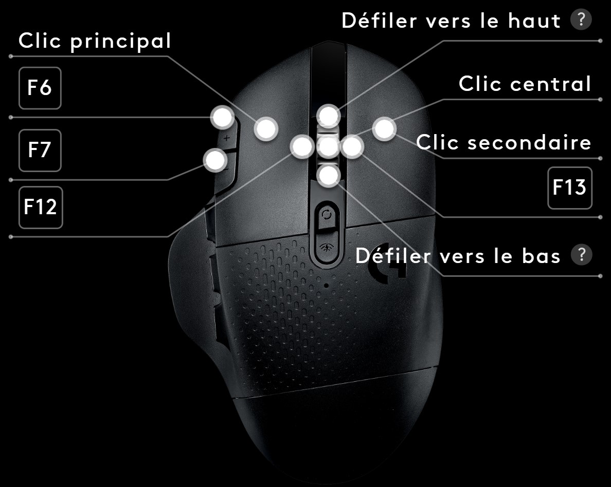

# MSFS_HandOnMouse
MSFS Utility to keep your HandOnMouse for easier/better flying

> MSFS virtual cockpits are wonderfully immersive but can become challenging when flying requires to actuate critical knobs and levers quickly.
> * Takeoffs may require to quickly **retract gear** and/or **flaps** before critical speeds are reached.
> * Landings may require to **adjust flaps** (or even **gliders' spoilers**) and/or **trim without delay**.
> * Touchdown on short runways may require prompt and precise use of **reverse throttle**.
> 
> Even with dedicated hardware such as quadrants, having to leave your mouse may badly delay other actions such as preparing the aircraft (lights, accessories), completing checklists, answering ATC, etc. I guess using VR mode makes all of these even more challenging.
> 
> The solution I use for quite some time now is this small utility that connects to MSFS to **map critical actions to mouse moves combined with dedicated buttons pressed**.

## Quick start guide

0. Extract all files from the archive to a folder
1. Run the MSFS_HandOnMouse application
2. Test the mouse sensitivity and adjust as required (depends on mouse resolution and desired range, beware that sensitivity will be reduced in interactions with MSFS)
3. Use the default mappings or click  buttons to select or adjust mappings to suit your plane or habits
4. Connect to MSFS and check that you can actuate the chosen controls with the mouse
6. Either hide the application window with "-" button or keep it on top in a compact form with "=" button

Since many mouse are equipped with forward/backward buttons and these are not mapped by default to anything, the utility comes with preconfigured mappings suited to various aircraft types using these buttons:
Mouse Button(s)       | MSFS Control
---------------       | ------------
**Forward alone**     | **Throttle** (forward-backward mouse move) and **Reverse Throttle** (protected by use of orthogonal mouse move)
**Backward alone**    | **Flaps** (forward-backward move) and **Landing Gear** (left-right move) OR using mapping files with trim: **Elevator trim** (forward-backward move) or **Aileron trim** (left-right move)
**Forward+Backward**  | **Propeller** or **Mixture** or **Spoilers** (for jets and gliders)  
Click  to assign | **Elevator trim** (forward-backward move) or **Aileron trim** (left-right move)

*NB: Controls with few positions such as flaps and gear are configured to wait for the buttons to be released before actually doing anything so you can revert an inadvertent move.*

Otherwise, you can read on to use other buttons, control other Simulation Variables, etc.

Enjoy, and let me know what you think!
Arnaud

## Custom mappings

Each mapping file (selected with top  button) defines a fixed set of axis and the only way to add an axis is to edit the file (see comments in Custom.ini file).
However, starting with version 2, you can customize each axis option including its trigger, direction, and smart options without having to edit files.
Indeed, the default mappings only use the mouse forward/backward buttons because they are not used by default but you can use the  button in front of any axis to customize how it is mapped to your hardware. 

For instance, if you only have a basic mouse without forward/backward buttons, you can map the axis to another mouse/joystick button instead.
On the contrary, if you have gaming mouse with many buttons like the G602, you can map each axis of any bi-turboprop to distinct buttons (see 2xThrottle+Prop.ini file).

*NB: Triggers are limited to the 5 standard mouse buttons, all keyboard keys, and 32 joystick buttons.*

## Smart trim 

Makes it a lot easier and faster to manually trim an aircraft:
- elevator/aileron trim sensitivity adapts to aircraft's IAS and Vc cruise speed to compensate higher aerodynamic forces for higher velocities
- elevator trim automatically opposes centering elevator inputs to compensate for the absence of Force-Feedback hardware (but this can be disabled)

> When you have a spring-centered stick/yoke, you should **try to trim with the mouse as this will save you precious time during approaches**.
> Trimming is essential to a stabilized approach but it is difficult to simulate due to the variety of trimming implementations and the sparsity of Force-Feedback hardware. 
> In MSFS it is more complex than it is in real life, at least in GA aircrafts and gliders. 
> So, the utility implements a smarter way to manually trim your aircraft so you have time to perform all the other things to do during an approach.

It makes a lot of sense to assign a joystick button to this function, so, you have to customize it to your specific hardware to enable it.
Click  in front of the "elevator trim" axis then "Set trigger and mouse move" and follow the instructions:
1. Press the joystick button you want to use to trim
2. Move the mouse towards you (Draw)
3. Release the button

Save the customization, and repeat with the "aileron trim" axis using the same trigger but with a mouse move to the right

When you need to apply too much effort to maintain your stick/yoke in position:
1. Use the mouse to grab the trim control (press the chosen trigger)
2. Gently center back your stick/yoke (you can also move the mouse forward/backward to maintain a perfect attitude) 
3. Release the trim control
4. If trimming is not perfect, you can adjust it with the mouse, or with stick/yoke (back to #1)

*NB: The default smart trim sensitivity works well for most default aircrafts but not all, so, you may need to adjust it (use the  axis button)*

## Smart Throttle 

The throttle range automatically adapts to the loaded aircraft to enable reverse throttle when available.

> When the runway is short, reverse throttle need to be used as soon as the aircraft touches the ground but not before!
> In real life, the reverse range is protected by detents. 
> The utility simulates this by using the same button but a mouse move orthogonal to the direction chosen for forward throttle.

Just before the flare:
1. Make a large mouse move towards idle throttle
2. Wait to touch the ground
3. Move the mouse to the right to apply reverse

On a sloped runway you can quickly revert to forward throttle to make sure you reach the platform:
1. Move the mouse forward to get out of the reverse range and apply the necessary power

*NB: Move the mouse backward/forward in the reverse throttle range in case you configured forward throttle in a left/right direction*

When using Jet.ini mappings, a detent is also set at 90% position to allow for better control over the auto-throttle positions. 
This should be adjusted though to better suit the detents available in each jet.

## Smart brakes 

Brake SimVars cannot be used for precise braking, so brakes are made available with a virtual joystick driver named vJoy.
A single trigger can be used in a smart way to control both right & left brakes:
- backward mouse moves will brake on both sides
- a left or right leaning mouse move will apply more brakes on the corresponding side
- appled brakes will automatically return to neutral position when the corresponding trigger is released

vJoy axis can also be used to increase sensitivity to mouse movements since changes coming from MSFS are ignored.

Using any vJoy mapping requires to:
1. Download vJoy driver: https://sourceforge.net/projects/vjoystick/files/Beta%202.x/2.1.9.1-160719/vJoySetup.exe/download
2. Install it by running: vJoySetup.exe
3. Map vJoy axis displayed by HandOnMouse to desired MSFS functions

## Support planes incompatible with SimVars

vJoy.ini mappings uses vJoy including some smart features (detents, autocentering) to better support planes not totally supporting SimVars like Aerosoft's CRJ
1. Select vJoy.ini possibly editing it to remove axis or features you do not need (say, rudder, brakes)
2. Map MSFS controls to vJoy device as in:  (beware to select "reverse" for the appropriate axis)

To use reverse throttle with CRJ, you must use its tablet, access last "options" page and "calibrate throttle" to enable reverse range and set an Idle value close to the one in: 

## G602 mouse mappings

The Logitech G602 mouse can replace a full quadrant with this utility and much more!
Configure the following G Hub mappings, select G602.ini mappings file in MSFS_HandOnMouse, and you are good to go with almost any aircraft from gliders to jets!

Mouse Button(s)       | MSFS Control
---------------       | ------------
**F16 & F/Suivant**   | Right & Left **Throttle** (forward-backward move) and **Reverse Throttle** (protected by use of orthogonal move)
**F17 & B/Précédent** | Right & Left **Propeller** (but you can use them to trigger **Mixture** with  button)
**F18**               | Right & Left **Brakes** (backward and right or left move))  
**F19**               | **Spoilers** (for jets and gliders)  
**F12** / **F13**     | Toggle **Landing Gear**
**F7**                | **Flaps** Down
**F6**                | **Flaps** Up
Click  to assign | **Elevator trim** (forward-backward move) or **Aileron trim** (left-right move)

 

---

## Version 3.0

ALPHA version, testing with MSFS Sim Update 9 to do

Please install in a separate place than version 2 as some user configuration settings changed. 
Customized .ini mappings files from version 2 "Mappings" folder can be copied to the new version "Mappings" folder without change.
* Improves mouse move sensitivity when connected
* Adds control (in %/s) of axis changes from MSFS to avoid, e.g. throttle set to zero when exiting MSFS "options" menu
* Improves main window to select predefined axis mappings more intuitively and hide/lock specific ones from the main window
* Adds ability to hide topmost gauges window
* Adds ability to lock specific axis
* Adds standard gear icons for advanced settings instead of "..." buttons
* Alt+F4 does not quit HandsOnMouse anymore when connected
* Removes unreliable SimConnect in-sim Text messages that appeared indefinitely in specific conditions
* Fixes sporadic input loss after loading an aircraft
* Adds detection of missing trim axis for hiding mappings

## Version 2.1

* Improves axis window to understand options more intuitively
* Adds ability to hide specific axis (those Not Available are hidden automatically)

## Version 2.0

* Adds support for triggering axis changes from HID compatible device buttons like joystick triggers
* Adds configuration button to change mappings trigger, direction and smart options and save them to a user specific file or reset them to the defaults defined in the mappings file
* Adds optional log file for troubleshooting if needed

## Version 1.4

* Adds vJoy.ini mappings using vJoy including some smart features (detents, autocentering) to better support planes not totally supporting SimVars like Aerosoft's CRJ

## Version 1.3

* Adds visual cues to reverse throttle and center of left/right axis
* Adds other smart mappings, used in Thr+Yoke+Pedals.ini to replace a yoke or pedals : aileron, rudder and brakes

## Version 1.2

* Adds other smart mappings :
- flaps maximum value adapts to the current aircraft
- throttle minimum value adapts to the current aircraft to enable reverse throttle when available

## Version 1.1

* Adds smart trim mappings making it a lot easier and faster to trim an aircraft:
- elevator/aileron trim sensitivity adapts to aircraft's IAS and design Vc to compensate higher aerodynamic forces for higher velocities 
- elevator trim automatically compensates centering elevator inputs to compensate for the absence of Force-Feedback hardware

## Version 1

* Initial release
